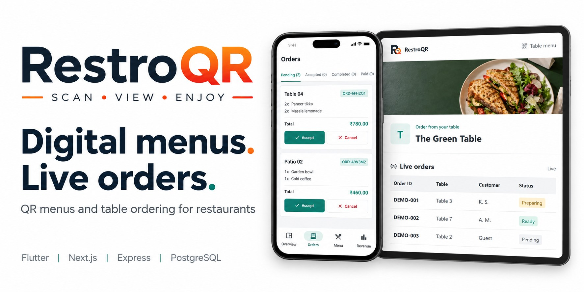
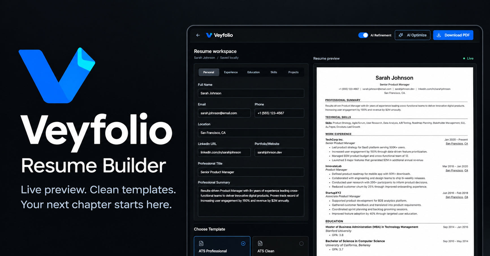

  <a href="https://thekartiksharma.in">Portfolio</a> &nbsp; / &nbsp;
  <a href="#selected-products">Products</a> &nbsp; / &nbsp;
  <a href="#toolkit">Toolkit</a> &nbsp; / &nbsp;
  <a href="mailto:kartikuma9261@gmail.com">Contact</a>

<table>
<tr>
<td width="25%" valign="middle">
  
</td>
<td width="75%" valign="middle">
  JAIPUR, INDIA &nbsp; / &nbsp; FULL STACK &amp; MOBILE
  <h1>Kartik Sharma</h1>
  <h3>Thoughtful interfaces. Practical products.</h3>
  
I build web applications, Android apps and the APIs behind them, with a focus on usable interfaces and reliable everyday workflows.

  
<strong>Full Stack &amp; MERN Developer</strong> &nbsp; | &nbsp; Flutter &amp; Kotlin

  
<a href="https://thekartiksharma.in"><strong>Explore my portfolio &rarr;</strong></a> &nbsp;&nbsp; <a href="https://linkedin.com/in/kartik-sharma06">LinkedIn</a>

</td>
</tr>
</table>

  
  
  

## Selected Products

A few things I am building across the web and Android.

<table>
<tr>
<td width="50%" valign="top">
  
  01 &nbsp; / &nbsp; RESTAURANT OPERATIONS
  <h3>RestroQR</h3>
  
Digital menus, table QR ordering and a privacy-aware live order board. Owners manage menus, tables, orders and earnings from the Android app.

  
FLUTTER &nbsp; / &nbsp; NEXT.JS &nbsp; / &nbsp; EXPRESS &nbsp; / &nbsp; POSTGRESQL

  
<a href="https://restroqr.thekartiksharma.in"><strong>Visit website &rarr;</strong></a> &nbsp; <a href="https://github.com/KartikSharma4448/RestroQR">Source code</a>

</td>
<td width="50%" valign="top">
  
  02 &nbsp; / &nbsp; RESUME WORKSPACE
  <h3>Veyfolio</h3>
  
A focused resume builder with two templates, live preview, project sections, browser autosave, keyword checks and matching PDF export.

  
REACT &nbsp; / &nbsp; FASTAPI &nbsp; / &nbsp; TAILWIND CSS &nbsp; / &nbsp; JSPDF

  
<a href="https://veyfolio.thekartiksharma.in"><strong>Visit website &rarr;</strong></a> &nbsp; <a href="https://github.com/KartikSharma4448/Veyfolio">Source code</a>

</td>
</tr>
</table>

### More From My Workbench

| Product | Focus | Explore |
| :--- | :--- | :--- |
| **My Purse** | Offline Android vault for cards, ID images and PDFs, with encrypted on-device storage. Kotlin + Jetpack Compose. | [Case study](https://thekartiksharma.in/projects/my-purse-offline-android-wallet) / [Source](https://github.com/KartikSharma4448/My-Purse) |
| **VCC ERP** | Coaching institute workflows across a Flutter mobile app and web administration. | [Case study](https://thekartiksharma.in/projects/vcc-erp-coaching-institute-management) / [Source](https://github.com/KartikSharma4448/vcc-erp) |
| **Rajasthali** | Travel and fleet operations with driver/client apps and an admin dashboard. | [Case study](https://thekartiksharma.in/projects/rajasthali-travel-fleet-management-system) / [Source](https://github.com/KartikSharma4448/Rajasthali-Traveling-System) |

[All projects, screenshots and case studies &rarr;](https://thekartiksharma.in/projects)

## Toolkit

| Interfaces | Services | Mobile | Data |
| :--- | :--- | :--- | :--- |
|  |  |  |  |
| React | Node.js / Express | Flutter / Dart | PostgreSQL |
| Next.js | Python / FastAPI | Kotlin | MongoDB |
| TypeScript | REST APIs | Jetpack Compose | Supabase / Firebase |
| Tailwind CSS | Authentication | Android | Redis |

## Background

<strong>BCA in Full Stack &amp; Cloud Computing</strong> 
Vivekananda Global University, Jaipur &nbsp; / &nbsp; **CGPA: 7.89**

I enjoy working across product interfaces, backend services and mobile experiences, from the first usable screen to the workflows behind it.

---

  HAVE A PRODUCT IN MIND? 
  <strong>Let's build something useful.</strong>  
  <a href="mailto:kartikuma9261@gmail.com">Email me</a> &nbsp; / &nbsp;
  <a href="https://linkedin.com/in/kartik-sharma06">LinkedIn</a> &nbsp; / &nbsp;
  <a href="https://thekartiksharma.in">thekartiksharma.in</a>

